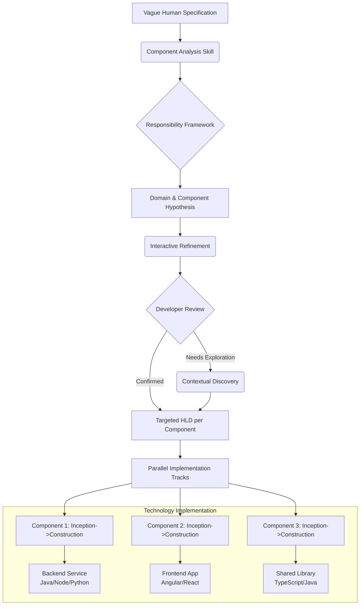

# Technology-Agnostic Architectural Reasoning Partner for Cursor

## Overview
A complete system to transform vague human specifications into targeted technical intents for complex systems with 50-60+ components (backend services, frontend apps, libraries). This partner uses **abstract architectural reasoning patterns** rather than technology-specific mappings, making it adaptable to Java, Angular, TypeScript, microservices, monoliths, or any hybrid architecture.

## System Architecture



## Core Components

### 1. **Foundation Rule: Technology-Agnostic Responsibility Framework**
**File:** `.cursor/rules/00_arch_responsibility_framework.mdc`

```markdown
# ARCHITECTURAL REASONING FRAMEWORK
## Core Principle: Think in Business Capabilities, Not Technologies

## DOMAIN MAP: Business Capabilities → Component Groups
### [Order Management Domain]
- **Business Responsibility:** Order lifecycle, pricing, fulfillment, returns
- **Typical Components:** `order-service`, `fulfillment-service`, `pricing-engine`, `returns-processor`
- **Owns Data Models:** Order, OrderLine, Shipment, Invoice
- **Owns Business Rules:** Pricing calculations, fulfillment rules, return policies
- **Trigger Phrases:** "place order", "cancel order", "calculate total", "ship item", "process return"

### [Customer & Identity Domain]
- **Business Responsibility:** Customer data, authentication, profiles, organizational relationships
- **Typical Components:** `customer-service`, `auth-service`, `profile-service`, `relationship-service`
- **Owns Data Models:** Customer, User, Account, Organization
- **Owns Business Rules:** Authentication flows, profile management, access control
- **Trigger Phrases:** "customer profile", "user login", "manager approval", "contact info", "access role"

### [Frontend Experience Domain]
- **Business Responsibility:** User interfaces, client-side logic, user interactions
- **Typical Components:** `web-app`, `admin-portal`, `mobile-app`, `dashboard-ui`
- **Owns UI Concerns:** Pages, components, client-side state, user experience
- **Communication:** Consumes APIs, emits user events, manages client state
- **Trigger Phrases:** "user interface", "display page", "interactive element", "form validation", "dashboard view"

### [Integration & Event Domain]
- **Business Responsibility:** Cross-component communication, notifications, system events
- **Typical Components:** `notification-service`, `event-bus`, `message-router`, `audit-service`
- **Owns Communication:** Message formats, event schemas, routing logic
- **Communication Patterns:** Pub/sub, request/response, webhook dispatches
- **Trigger Phrases:** "send notification", "publish event", "log change", "broadcast update", "webhook callback"

### [Analytics & Reporting Domain]
- **Business Responsibility:** Data aggregation, reporting, metrics, business intelligence
- **Typical Components:** `analytics-engine`, `reporting-service`, `metrics-collector`, `dashboard-backend`
- **Owns Data Models:** Report, Metric, Dashboard, Aggregation
- **Owns Business Rules:** Calculation formulas, aggregation logic, data transformation
- **Trigger Phrases:** "generate report", "track metrics", "data aggregation", "business intelligence", "performance dashboard"

## ARCHITECTURAL REASONING GUIDELINES
1. **Primary Data Ownership Rule:** Identify which domain OWNS the core business entity/state being modified.
2. **Side Effect/Reaction Rule:** If the spec describes a reaction, notification, or follow-up action, the Integration & Event domain is involved.
3. **User Interface Rule:** If the spec describes something a user sees or interacts with, the Frontend Experience domain is involved.
4. **Lookup/Dependency Rule:** If a component needs data it doesn't own, it depends on another domain's component.
5. **Confidence Scoring:**
   - **High:** Direct entity ownership + clear action within single domain
   - **Medium:** Cross-domain collaboration or indirect involvement
   - **Low:** Possible side effect or speculative change

## COMPONENT IDENTIFICATION PATTERNS
- **Backend Services:** Handle business logic, data persistence, complex computations
- **Frontend Applications:** Handle user interaction, presentation logic, client-side state
- **Shared Libraries:** Provide reusable utilities, common models, cross-cutting concerns
- **Integration Components:** Route messages, transform data, coordinate workflows

## OUTPUT STANDARD
Always present architectural hypotheses as:
1. **Targeted Components** with their domains and confidence levels
2. **Specific questions** to confirm/refine component responsibilities
3. **Probable change types** per component (data model, API, UI, integration, etc.)
```

### 2. **Core Skill: Technology-Agnostic Analysis Engine**
**File:** `.cursor/skills/architecture/tech_agnostic_analysis.md`

```markdown
name: tech-agnostic-analysis-engine
description: Primary reasoning engine that analyzes specs against business domains without technology assumptions.

# ANALYSIS WORKFLOW

## Phase 1: Parse & Tag Specification
**Input:** "When a premium customer submits a support ticket, show their priority status on the agent dashboard and notify the assigned team lead."

**Tagging Output:**
- Business Entities: `premium customer`, `support ticket`, `agent dashboard`, `team lead`
- Business Actions: `submits`, `show status`, `notify`
- Business Qualifiers: `premium`, `assigned`, `priority`

## Phase 2: Domain Mapping Logic
```javascript
// Conceptual mapping logic (not actual code)
const businessToDomainMap = {
  'customer': ['Customer & Identity'],
  'premium tier': ['Customer & Identity'], 
  'support ticket': ['Customer & Identity', 'Integration'], // Could be either
  'dashboard': ['Frontend Experience', 'Analytics'],
  'agent': ['Customer & Identity'],
  'team lead': ['Customer & Identity'],
  'notify': ['Integration & Event'],
  'show status': ['Frontend Experience'],
  'submit form': ['Frontend Experience', 'Backend Processing']
};
```

## Phase 3: Generate Impact Matrix
**Output Table:**
| Domain | Impact Type | Confidence | Reasoning |
|--------|-------------|------------|-----------|
| **Customer & Identity** | Core Change | High | Owns customer data, premium status, agent assignments |
| **Frontend Experience** | UI Change | High | "show on dashboard" requires UI updates |
| **Integration & Event** | Side Effect | High | "notify" requires messaging |
| **Analytics & Reporting** | Possible | Medium | Dashboards often involve analytics components |

## Phase 4: Propose Component-Level Hypothesis
```markdown
## ARCHITECTURAL HYPOTHESIS

### 1. Customer & Identity Domain
**Likely Components:** `customer-service`, `support-service`, `user-management`
**Probable Changes:**
- Enhance customer model to track "premium" status
- Modify support ticket creation to check premium status
- Extend agent assignment logic to consider team leads
**Questions to Confirm:**
- Which component currently manages support tickets?
- Where is "premium customer" status determined?

### 2. Frontend Experience Domain
**Likely Components:** `agent-dashboard-app`, `admin-portal`
**Probable Changes:**
- Add "customer priority" indicator to ticket display
- Create/modify dashboard view for team leads
**Questions to Confirm:**
- Is there a dedicated agent dashboard application?
- Should this be a new UI component or enhancement to existing?

### 3. Integration & Event Domain
**Likely Components:** `notification-service`, `event-bus`
**Probable Changes:**
- Create "PremiumTicketCreated" event
- Add notification routing to team leads
**Questions to Confirm:**
- Is there an existing notification system for support events?
- What channels are used (email, in-app, chat)?

## Phase 5: Interactive Refinement Prompts
**Present to Developer:**
1. "Which component currently owns the support ticket creation flow?"
2. "Is there a separate `agent-dashboard` frontend application?"
3. "Do we have an existing event for ticket creation that I should extend?"
```

### 3. **Command: Technology-Agnostic Discovery**
**File:** `.cursor/rules/10_tech_agnostic_discovery.mdc`

```markdown
# COMMAND: /discover-component [business-context]
**Purpose:** Investigate codebase to identify components handling specific business capabilities.

## Discovery Patterns:

### 1. Find by Business Entity
```
/discover-component customer premium status
```
**Executes:**
- Search for terms: "premium", "customer", "tier", "status" in code and configs
- Look for component names: `*customer*`, `*tier*`, `*account*`
- Analyze findings: "Found `customer-service` with `CustomerTier` model. Found `billing-service` with `Subscription` model mentioning premium features."

### 2. Find by User Interface
```
/discover-component agent dashboard
```
**Executes:**
- Search frontend code: `*dashboard*`, `*agent*`, UI component names
- Look for route definitions: `/agent/*`, `/dashboard/*`
- Check configuration: app names, module definitions
- Report: "Found `agent-portal` Angular application with `DashboardModule`. Contains `TicketDashboardComponent`."

### 3. Find by Integration Point
```
/discover-component notify ticket created
```
**Executes:**
- Search for: "event", "publish", "notify", "listener"
- Look for message schemas: `*Event`, `*Message`, `*Notification`
- Find configuration: message queues, event buses, webhook endpoints
- Report: "Found `support-events` topic in event bus configuration. Found `NotificationService` in `shared-libs`."

### 4. Find by Data Model
```
/discover-component support ticket model
```
**Executes:**
- Search for: "ticket", "support", "issue" in model definitions
- Look for: `interface`, `class`, `type`, `schema` definitions
- Database: migration files, schema definitions, ORM models
- Report: "Found `SupportTicket` interface in `shared-models` library. Found `tickets` table in `support-service` migrations."

## AUTO-DISCOVERY RULE:
When confidence is "Low" or when multiple components could be involved, automatically prompt:
"Would you like me to run `/discover-component [business-context]` to investigate which components handle this?"
```

### 4. **Skill: HLD Refinement for Any Technology**
**File:** `.cursor/skills/architecture/agnostic_hld_refinement.md`

```markdown
name: agnostic-hld-refinement
description: Interactive skill to refine hypotheses into concrete HLD for any tech stack.

# REFINEMENT DIALOGUE PATTERNS

## Pattern A: Clarifying Component Boundaries
**When:** Multiple components could own a business entity.
**Dialogue:**
```
AI: "You mentioned 'support ticket'. I found references in:
     1. `support-service` (backend, owns ticket lifecycle)
     2. `shared-models` (library, defines ticket interfaces)
     3. `agent-portal` (frontend, displays tickets)
     Which component should handle the creation logic?"
     
User: "`support-service` handles creation, `shared-models` defines shape, `agent-portal` displays."
     
AI: "Updated: `support-service` gets 'Core Change', others get 'Consumption Change'."
```

## Pattern B: Identifying Integration Patterns
**When:** Components need to communicate.
**Dialogue:**
```
AI: "For 'notify team lead', I need to know:
     - Is there an existing notification system?
     - Should this be synchronous (API call) or asynchronous (event)?"
     
User: "We use async events via our message bus. There's a `notification-service` that listens to events and sends emails/Slack messages."
     
AI: "Added: `support-service` publishes `TicketCreatedEvent`, `notification-service` consumes it and notifies team leads."
```

## Pattern C: Final HLD Assembly (Technology-Agnostic)
**Template Output:**
```markdown
# FINAL HLD: [Feature Name]

## 1. support-service (Customer & Identity Domain)
**Changes Required:**
- Extend ticket creation to check customer premium status
- Include premium flag in ticket data model
- Publish enhanced `PremiumTicketCreatedEvent` with team lead info

**Data Model Updates:**
- Add `isPremiumCustomer: boolean` to ticket creation request
- Add `assignedTeamLeadId: string` to ticket model

**Integration Points:**
- Publishes: `PremiumTicketCreatedEvent(ticketId, isPremium, teamLeadId)`
- Consumes: Customer data from `customer-service` (API call)

## 2. agent-portal (Frontend Experience Domain)
**Changes Required:**
- Add visual indicator for premium customer tickets in dashboard
- Create/update team lead notification view component
- Enhance ticket detail view with priority information

**UI Components:**
- New: `PremiumBadgeComponent` (displays premium status)
- Modified: `TicketListComponent` (integrates premium badge)
- Modified: `DashboardView` (shows team lead notifications)

## 3. notification-service (Integration & Event Domain)
**Changes Required:**
- Add consumer for `PremiumTicketCreatedEvent`
- Implement team lead notification logic (email + Slack)
- Add configuration for team lead notification templates

**Integration Points:**
- Consumes: `PremiumTicketCreatedEvent` from message bus
- Calls: Slack API, Email service

## 4. customer-service (Customer & Identity Domain)
**Changes Required:**
- Expose API endpoint: `GET /customers/{id}/premium-status`
- No data model changes required

## DEPENDENCY GRAPH:
support-service → customer-service (API call)
support-service → message-bus (event publish)
notification-service → message-bus (event consume)
agent-portal → support-service (API calls for tickets)

## IMPLEMENTATION NOTES:
- Frontend and backend can be developed in parallel once APIs/events are defined
- Events should use shared models from `shared-models` library
- UI changes should follow existing design system patterns
```
```

## Complete Workflow Example

### **Scenario:** Complex Multi-Component Specification

**Business Specification (Non-Technical):**
> "When a high-value transaction is detected, display a warning flag in the merchant portal, notify the risk analysis team via their dashboard, and create a case in the investigation system. Also, ensure the customer's recent transactions are reviewed."

---

### **Step 1: Initial Analysis**
**Developer in Cursor:**
```
/analyze-architecture
When a high-value transaction is detected, display a warning flag in the merchant portal, 
notify the risk analysis team via their dashboard, and create a case in the investigation system. 
Also, ensure the customer's recent transactions are reviewed.
```

**Cursor's Analysis Output:**
> **ARCHITECTURAL ANALYSIS RESULTS**
> 
> **Identified Business Domains & Confidence:**
> 1. **Transaction Processing** [HIGH]
>    - Business Entities: "high-value transaction", "transaction detection"
>    - Components likely: `transaction-processor`, `fraud-detection`, `payment-service`
> 
> 2. **Frontend Experience** [HIGH]  
>    - Business Actions: "display warning flag", "merchant portal", "risk dashboard"
>    - Components likely: `merchant-portal-app`, `risk-dashboard-app`
> 
> 3. **Integration & Event** [HIGH]
>    - Business Actions: "notify", "create case", "ensure review"
>    - Components likely: `notification-service`, `case-management`, `workflow-orchestrator`
> 
> 4. **Customer & Identity** [MEDIUM]
>    - Business Entities: "customer's recent transactions"
>    - Components possibly: `customer-service`, `transaction-history`
> 
> **KEY QUESTIONS TO REFINE:**
> 1. Which component currently detects "high-value transactions"?
> 2. Are "merchant portal" and "risk dashboard" separate applications or modules?
> 3. Is there an existing "investigation system" with case management?
> 4. Where is "customer transaction history" stored and accessed?
> 
> **Suggested next command:** `/discover-component transaction detection`

---

### **Step 2: Interactive Refinement & Discovery**
**Developer:**
```
/discover-component transaction detection high value
```

**Cursor's Discovery:**
> Found `transaction-monitoring-service` with `HighValueTransactionDetector` component.
> Found `merchant-portal` (Angular app) with `AlertDisplayComponent`.
> Found `risk-team-dashboard` (React app) with real-time alert feed.
> Found `case-management-service` with `createInvestigationCase` API.
> 
> **Updated Hypothesis:**
> - Transaction detection: `transaction-monitoring-service` [CONFIRMED]
> - Merchant portal: `merchant-portal` (Angular) [CONFIRMED]
> - Risk dashboard: `risk-team-dashboard` (React) [CONFIRMED]
> - Case system: `case-management-service` [CONFIRMED]
> 
> **New Questions:**
> 1. How should the monitoring service communicate with frontend apps?
> 2. Should transaction review happen synchronously or be queued?

**Developer continues dialogue, confirming integration patterns and data flows.**

---

### **Step 3: Final HLD Generation (Technology-Agnostic)**
**Cursor's Final Output:**
```markdown
# HLD: High-Value Transaction Alerting & Case Management

## 1. transaction-monitoring-service (Transaction Processing Domain)
**Changes Required:**
- Enhance detection rules for "high-value" threshold configuration
- Generate `HighValueTransactionAlert` event with full context
- Call `customer-service` to fetch recent transaction history

**Data Model Updates:**
- Add `riskScore` and `valueCategory` to transaction alert model
- Extend alert metadata with customer context

**Integration Points:**
- Publishes: `HighValueTransactionAlert` event to message bus
- Calls: `customer-service` API for transaction history
- Calls: `case-management-service` API to create case

## 2. merchant-portal (Frontend Experience Domain - Angular)
**Changes Required:**
- Create `HighValueAlertFlagComponent` for transaction lists
- Add real-time alert subscription via WebSocket
- Create alert detail modal with investigation options

**UI Components:**
- New: `HighValueAlertFlagComponent` (visual indicator)
- Modified: `TransactionListComponent` (integrates alert flags)
- New: `AlertDetailModalComponent` (drill-down view)

## 3. risk-team-dashboard (Frontend Experience Domain - React)
**Changes Required:**
- Add high-value transaction alert feed widget
- Implement real-time updates via event stream
- Add "create case" quick action from alert items

**UI Components:**
- New: `HighValueAlertFeed` widget for dashboard
- Modified: `DashboardLayout` to include new widget
- Enhanced: `AlertManagementPanel` with new alert type

## 4. case-management-service (Integration & Event Domain)
**Changes Required:**
- Add API endpoint for automated case creation
- Enhance case model with transaction alert references
- Add business rules for high-value transaction cases

**Integration Points:**
- Provides: `POST /cases/from-transaction-alert` API
- Consumes: Transaction context from monitoring service

## 5. notification-service (Integration & Event Domain)
**Changes Required:**
- Add consumer for `HighValueTransactionAlert` events
- Implement risk team notification (in-app + email)
- Add escalation rules for unacknowledged alerts

## 6. customer-service (Customer & Identity Domain)
**Changes Required:**
- Expose enhanced API: `GET /customers/{id}/transactions/recent`
- Add query parameters for risk assessment context

## COMMUNICATION FLOW:
1. transaction-monitoring-service → detects → publishes event → creates case
2. message-bus → delivers event → to frontends & notification-service
3. frontend apps → subscribe → update UI in real-time
4. notification-service → sends → risk team alerts

## IMPLEMENTATION NOTES:
- Frontend apps can use different technologies (Angular, React) but consume same events
- Events should use shared schema definitions
- Real-time updates recommended but fallback to polling acceptable
- Case creation should be idempotent (same alert doesn't create duplicate cases)
```

---

### **Step 4: Execute Parallel Implementation Tracks**

**For Backend Components (transaction-monitoring-service, case-management-service):**
1. Use backend-focused AI-DLC skills for API design, event publishing, service logic
2. Implement in chosen technology (Java, Node.js, Python, etc.)
3. Focus on reliability, data consistency, error handling

**For Frontend Components (merchant-portal Angular app):**
1. Use Angular-focused AI-DLC skills for component design, service integration
2. Implement Angular components, services, modules
3. Focus on user experience, responsive design, real-time updates

**For Frontend Components (risk-team-dashboard React app):**
1. Use React-focused AI-DLC skills for hooks, components, state management
2. Implement React components, custom hooks, context providers
3. Focus on real-time data visualization, interactive elements

**For Shared Concerns:**
1. Use library-focused AI-DLC skills for shared models, utilities
2. Ensure consistency across technology boundaries
3. Maintain backward compatibility

## Technology-Specific Skill Integration

**To make this truly adaptable, create technology-specific skills that plug into this framework:**

### Angular Skill Example:
**File:** `.cursor/skills/frontend/angular_patterns.md`
```markdown
name: angular-patterns
description: Implementation patterns for Angular applications in our architecture.

# When implementing Frontend Experience Domain changes:

## Component Creation Pattern
1. **Smart/Dumb Components:** 
   - Smart: `HighValueAlertService` (gets data)
   - Dumb: `HighValueAlertFlagComponent` (displays data)

## Service Integration:
```typescript
// Pattern for consuming backend events
@Injectable()
export class AlertStreamService {
  constructor(private websocketService: WebSocketService) {}
  
  getHighValueAlerts(): Observable<TransactionAlert> {
    return this.websocketService.connect('alerts/high-value');
  }
}
```

## State Management:
- Use RxJS for real-time streams
- Consider NgRx for complex state if already in use
- For simple state, use Service + BehaviorSubject pattern
```

### Backend Service Skill Example:
**File:** `.cursor/skills/backend/service_patterns.md`
```markdown
name: backend-service-patterns
description: Implementation patterns for backend services in our architecture.

# When implementing business domain changes:

## Event Publishing Pattern
```javascript
// Technology-agnostic pattern - implement in your language
class TransactionMonitor {
  detectHighValue(transaction) {
    if (this.isHighValue(transaction)) {
      const event = this.createAlertEvent(transaction);
      this.eventBus.publish('high-value-transaction', event);
      this.caseService.createCase(event);
    }
  }
}
```

## API Design:
- RESTful endpoints for synchronous operations
- Event-driven for asynchronous workflows
- Use shared API contracts/libraries
```

## Installation & Setup

### 1. Directory Structure
```
project-root/
├── .cursor/
│   ├── rules/
│   │   ├── 00_arch_responsibility_framework.mdc
│   │   ├── 10_tech_agnostic_discovery.mdc
│   │   └── [other project rules]
│   └── skills/
│       ├── architecture/
│       │   ├── tech_agnostic_analysis.md
│       │   └── agnostic_hld_refinement.md
│       ├── frontend/
│       │   ├── angular_patterns.md
│       │   └── react_patterns.md
│       └── backend/
│           └── service_patterns.md
├── docs/
│   └── architecture/
│       ├── component-responsibilities.md
│       └── integration-patterns.md
└── [individual component directories]
```

### 2. Initial Setup Session
With your team:

1. **Define Business Domains** (5-7 that match your organization)
2. **List Key Components** under each domain (start with the most frequently changed)
3. **Document Communication Patterns** between domains
4. **Save as** `.cursor/rules/00_arch_responsibility_framework.mdc`

### 3. Commands Cheat Sheet
```
/analyze-architecture [spec]    # Main analysis command
/discover-component [context]   # Business-context investigation  
/refine-hld                     # Interactive HLD refinement
/generate-final-hld            # Create final HLD document
```

## Benefits of This Approach

1. **True Technology Agnosticism:** Works with Java, Angular, Node.js, Python, React, etc.
2. **Business-Focused:** Reasons about what components DO, not how they're built
3. **Scalable:** Handles 5 or 50 components with same framework
4. **Adaptable:** New technologies can be added without framework changes
5. **Onboarding Friendly:** New developers understand the architecture through business capabilities
6. **Future-Proof:** Business domains change slower than technologies

This Architectural Reasoning Partner provides the structure needed to manage complexity while remaining completely flexible about implementation technologies. It focuses on the stable aspects of your system (business domains, component responsibilities) while being agnostic about the changing aspects (programming languages, frameworks, tools).